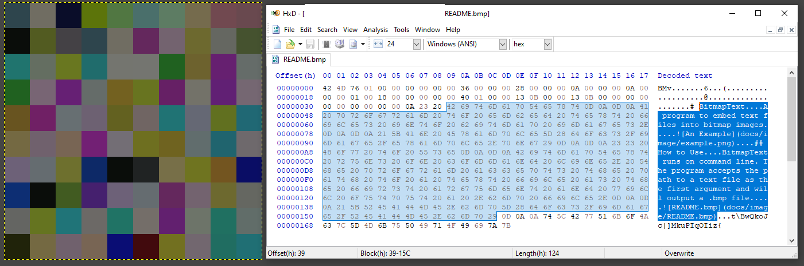

# BitmapText

A program to embed text files into bitmap images.

## How to Use

BitmapText runs on command line. The program accepts the path to a text file as the first argument and will output a .bmp file.

usage: bitmaptext.jar <text-file-path> \[<bmp-file-path>\] \[<width>\] | \[-h\]

