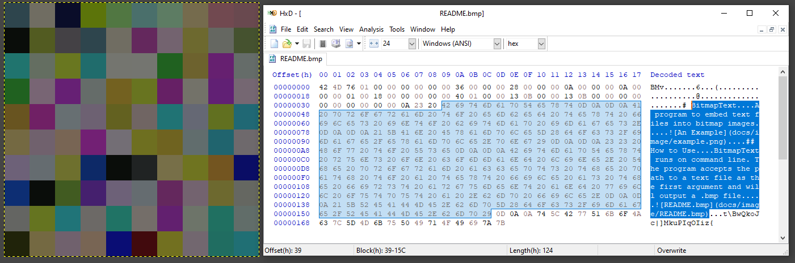

# BitmapText

A program to embed text files into bitmap images.

## How to Use

BitmapText runs on command line. The program accepts the path to a text file as the first argument and will output a .bmp file.

usage: `bitmaptext.jar -i <input-file> [-o <output-file>] [-w <width>] [-m [-c <r> <g> <b>]] | [-h]`
BitmapText will embed a text file in a bitmap image.
-i specifies the path to the file you want to embed.
-o specifies the path of the output bitmap file. The file will add \".bmp\" to the end of the path if not already present.
-w will create an image with the specified width. Without it, the program will create an image with width and height as close as possible. Non-integer arguments will be ignored.
-m creates an image with a single color. The program defaults to white when not specified with the -c flag.
-c specifies the rgb values of the final image if the -m flag was set. Each value must be an integer in range [0, 255]. Any invalid arguments will default the color to white.
-h will show this help text. This help text will also be displayed if no arguments are passed to the program.

